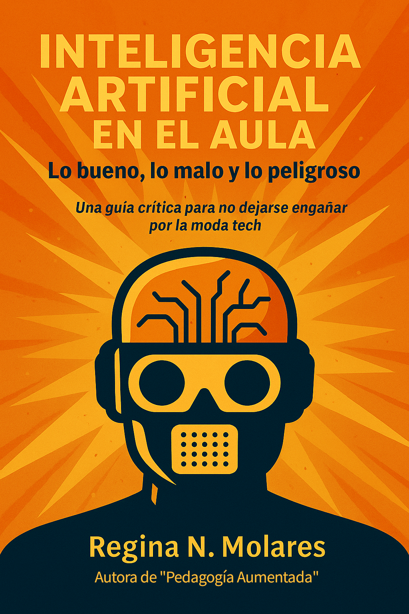

# 🧠 Inteligencia Artificial en el aula: lo bueno, lo malo y lo peligroso
### Una guía crítica para no dejarse engañar por la moda tech  
**Autora:** Regina N. Molares  
**Edición independiente, 2025**

---

---

## 📘 Sobre este libro

La inteligencia artificial ya está en las aulas, aunque no siempre sepamos cómo llegó ni qué hacer con ella.  
**Este libro invita a mirar con otros ojos lo que ya está pasando.**  
No hace falta saber de código ni tener poder de decisión: alcanza con estar dentro (o cerca) de una escuela.

“Inteligencia Artificial en el aula: lo bueno, lo malo y lo peligroso” ofrece una mirada crítica y accesible sobre el impacto real de la IA en la educación.  
Explora los riesgos, las oportunidades y los dilemas éticos que atraviesan a docentes, estudiantes y comunidades educativas frente al avance de la tecnología.

---

## 🧩 Temas principales

- Qué diferencia a la IA tradicional de la IA generativa  
- Cómo la automatización está redefiniendo la enseñanza y la evaluación  
- Riesgos invisibles: sesgos, vigilancia, deshumanización  
- Oportunidades reales: personalización, creatividad, inclusión  
- El rol del criterio pedagógico frente a la tecnología  
- Preguntas que todo educador debería hacerse antes de “usar IA”

---

## 📥 Descarga

El libro completo está disponible de forma gratuita en formato PDF.  
Podés leerlo, compartirlo o usarlo como material de reflexión en espacios educativos.  

👉 **[Descargar PDF desde GitHub](https://github.com/programming-Regina/IA_en_el_aula/blob/950bc8cb6f575c35006502a5ee76bd2bd1124a58/Inteligencia_Artificial_en_el_aula_-_Regina_N_Molares.pdf)**  

Si este trabajo te resultó valioso, podés apoyar su continuidad con un aporte voluntario:

- 💳 [Aporte por MercadoPago](https://link.mercadopago.com.ar/dataregina)  
- 💸 Ualá: **REGINA.HOBI.FAN**

> El conocimiento se multiplica cuando se comparte, pero solo se sostiene cuando se valora el trabajo que lo hace posible.

---

## 🧠 Proyecto relacionado: *Pedagogía Aumentada*

Este libro forma parte del proyecto **Pedagogía Aumentada**, una iniciativa orientada a repensar la enseñanza en tiempos de algoritmos y creatividad artificial.

📖 **Pedagogía Aumentada: Cómo enseñar y aprender en tiempos de algoritmos y creatividad artificial**  
Ofrece un marco analítico y práctico para docentes, directivos y responsables de políticas educativas.  
Si querés profundizar en el enfoque pedagógico y ético detrás de esta guía, podés explorar el trabajo completo en su versión académica.

---

## 🪶 Licencia y distribución

Este material fue desarrollado, editado y financiado de manera independiente.  
Podés compartirlo libremente con fines educativos y no comerciales, siempre citando la fuente.  

**© 2025 Regina N. Molares — Edición independiente**  
**Contacto:** [LinkedIn](https://www.linkedin.com/in/regina-molares/) | [Medium](https://medium.com/@data.regina.cursos)

---

## ⭐ Cómo citar este trabajo

> Molares, R. N. (2025). *Inteligencia Artificial en el aula: lo bueno, lo malo y lo peligroso.* Edición independiente.  
> Recuperado de [https://github.com/tu_usuario/Inteligencia-Artificial-en-el-Aula](https://github.com/programming-Regina/IA_en_el_aula)

---

